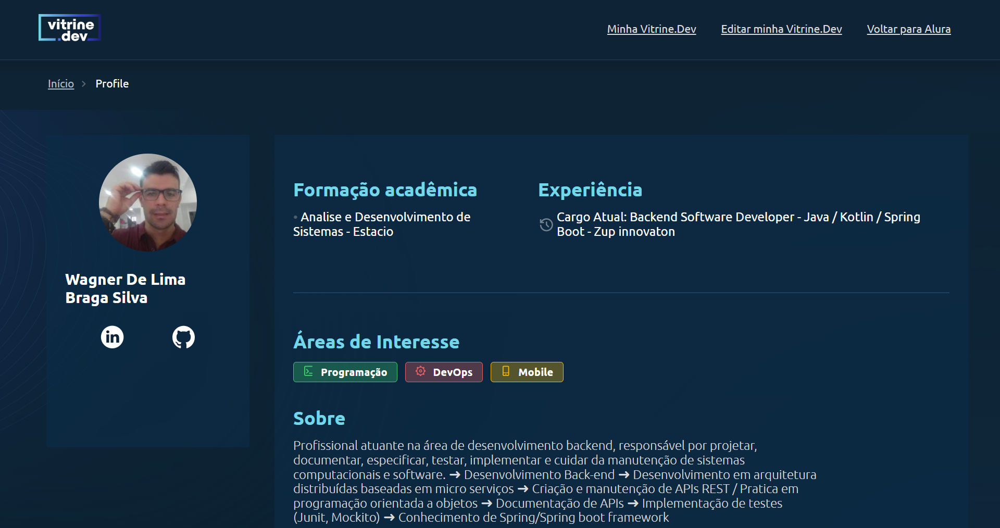
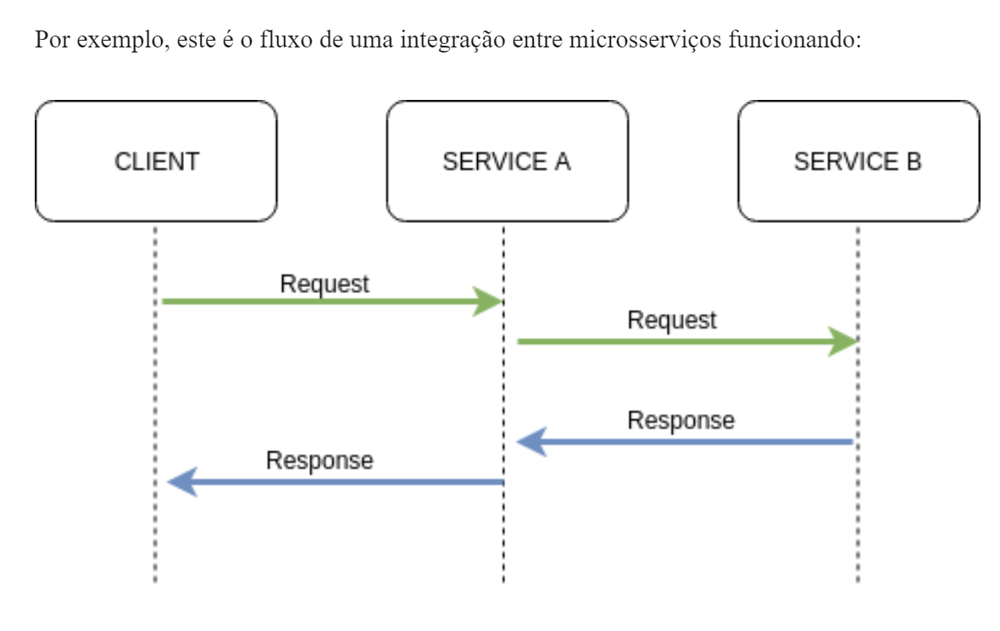
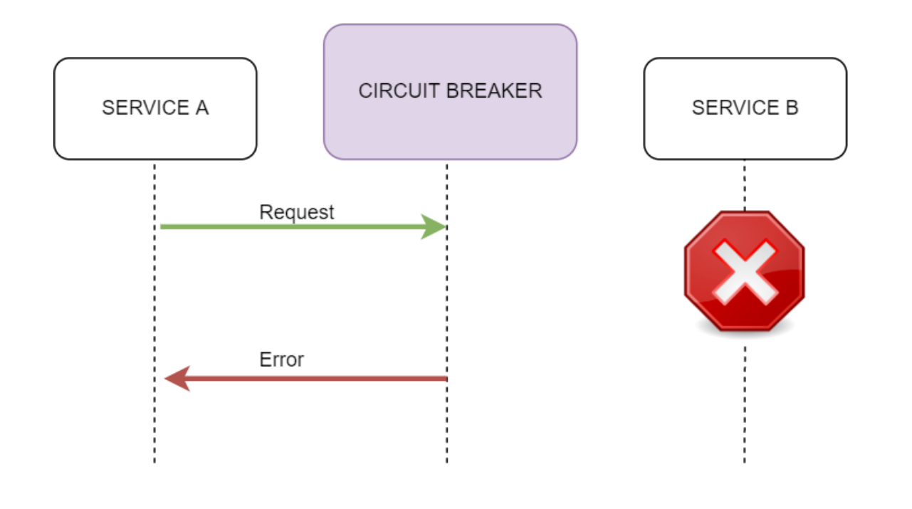
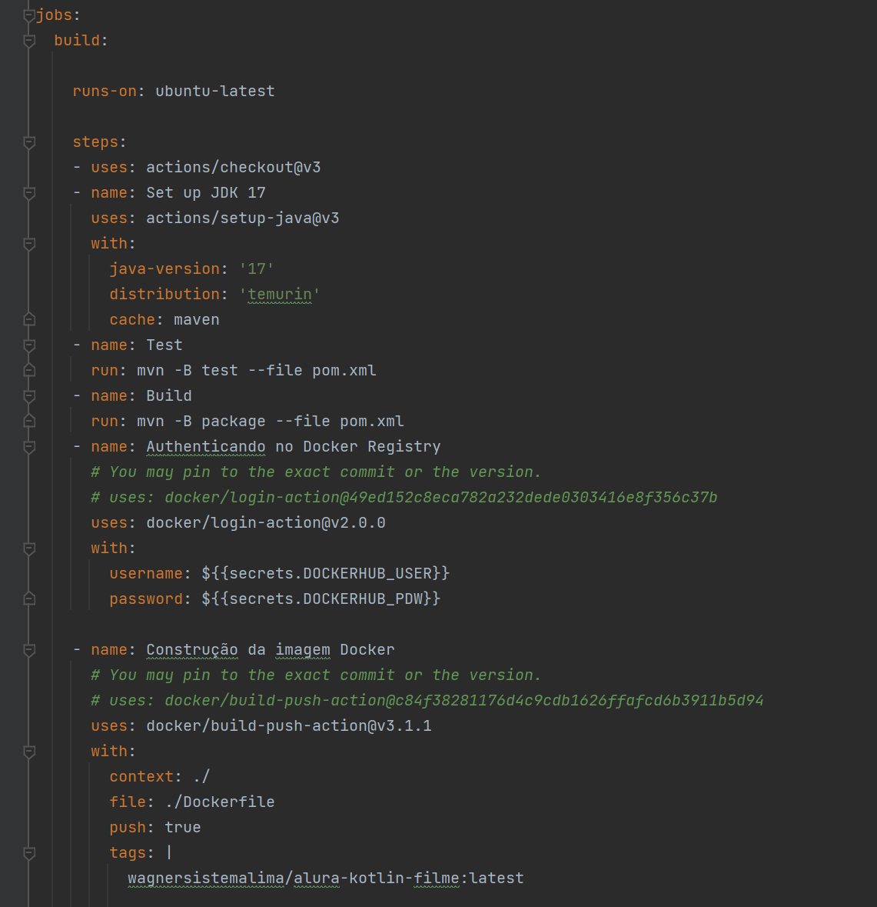

# API Strem Filmes

API do IMDB! Plataforma mais famosa que agrupa basicamente todos os filmes, séries, programas de TV, atores, etc., do mundo. Você pode imaginar que o banco de dados deles deve ser colossal!

| :placard: Vitrine.Dev |     |
| -------------  | --- |
| :sparkles: Nome        | **Desafio 7DaysOfCode**
| :label: Tecnologias | Kotlin, SpringBoot, Maven
| :rocket: URL         | https://url-deploy.com.br
| :fire: Desafio     | https://7daysofcode.io/matricula/java

<!-- Inserir imagem com a #vitrinedev ao final do link -->

[url-vitrine-dev](https://cursos.alura.com.br/vitrinedev/wagner-sistemalima)

## Detalhes do projeto

* webservice IMDB url : https://imdb-api.com/api

## Desafio

* Fazer o seu código Kotlin com Spring rodar e consumir a API do IMDB! Seu objetivo será imprimir os resultados de uma busca na linha de comando.
* Explicando melhor, você vai usar essa API para pesquisar os Top250 filmes e imprimir o JSON correspondente no console da sua IDE.
* Também será preciso gerar uma APIKey (uma chave de acesso), registrando o seu email no site. Com a chave em mãos, você poderá buscar filmes, séries, etc., através da API.
* Ah, e não se esqueça de compartilhar o seu código no seu GitHub e marcar a gente nas suas redes sociais com a hashtag #7DaysOfCode, e também com #feedback7DoC caso você queira alguma ajuda.

## Setup do Projeto

* Linguagem de programação: Kotlin
* Tecnologia: Spring Boot 2.7.6
* Gerenciador de dependência: Maven
* Java 17
* IDE IntelJ

### Implementação utilizando as ferramentas do ecossistema Spring com Java 17

* Spring Web: Crie aplicativos da web, incluindo RESTful, usando Spring MVC. Usa Apache Tomcat como o contêiner integrado padrão.
* Bean Validation: é uma especificação que permite validar objetos com facilidade em diferentes camadas da aplicação. A vantagem de usar Bean Validation é que as restrições ficam inseridas nas classes de modelo.
* Swagger

### Documentação da api
* url swagger: http://localhost:8080/swagger-ui.html
* Obrigatorio passar no header a Accept-Version da API de filme: v1
* GET url filme: http://localhost:8080/filmes/top250
* POST url filme favorito: http://localhost:8080/filmes/favoritos/{id}

### Resilience4j
* Resilience4j é uma biblioteca leve de tolerância a falhas projetada para programação funcional.
* As chamadas para serviços e recursos remotos podem falhar devido a instabilidades transitórias, como conexões de rede lentas, limites de tempo, recursos sobrecarregados ou temporariamente disponíveis. Estas falhas normalmente são corrigidas automaticamente após um curto período de tempo e uma aplicação robusta na cloud deve estar preparada para manipulá-las ao utilizar uma estratégia como o padrão de repetição.

* Construir um serviço tolerante a falhas e resiliente, que consiga sobreviver quando os principais serviços que ele consome estiverem passando por instabilidade.

### Pipeline CI/CD seguro com GitHub Actions
* Branch principal protegida main
* Brach develop / pull request
* build test
* build imagem
* publicação da imagem no docker registry

